## Setting up streaming replication
PSR (Physical Streaming Replication)  has two main way to set up streaming replication:
*  with an additional archive
*  without an additional archive

### Creating user

```bash
[root@node1 vagrant]# su - postgres 
-bash-4.2$    psql 
psql (11.5)
Type "help" for help.

postgres=# \list
                                  List of databases
   Name    |  Owner   | Encoding |   Collate   |    Ctype    |   Access privileges
-----------+----------+----------+-------------+-------------+-----------------------
 postgres  | postgres | UTF8     | en_US.UTF-8 | en_US.UTF-8 |
 template0 | postgres | UTF8     | en_US.UTF-8 | en_US.UTF-8 | =c/postgres          +
           |          |          |             |             | postgres=CTc/postgres
 template1 | postgres | UTF8     | en_US.UTF-8 | en_US.UTF-8 | =c/postgres          +
           |          |          |             |             | postgres=CTc/postgres
(3 rows)

postgres=# \du
                                   List of roles
 Role name |                         Attributes                         | Member
 of
-----------+------------------------------------------------------------+-------
----
 postgres  | Superuser, Create role, Create DB, Replication, Bypass RLS | {}
postgres=# CREATE USER repuser
             REPLICATION
             LOGIN
             CONNECTION LIMIT 10
             ENCRYPTED PASSWORD 'changeme';
CREATE ROLE
postgres=# \du+
                                          List of roles
 Role name |                         Attributes                         | Member of | Description
-----------+------------------------------------------------------------+-----------+-------------
 postgres  | Superuser, Create role, Create DB, Replication, Bypass RLS | {}        |
 repuser   | Replication                                               +| {}        |
           | 2 connections                                              |           |

postgres=# exit
```

### Authenriztion about replication
/var/lib/pgsql/11/data/pg_hba.conf

```conf
local  replication   all                trust 
host   replication   all  127.0.0.1/32  trust  
host   replication   all  ::1/128       trust  
host   replication   all  0.0.0.0/0     trust  

```

### Without  an additional archive (method-1)
step 8 Take a base  backup (with an additional archive)
```bash
-bash-4.2$ pg_basebackup  -D slave  --checkpoint=fast  --wal-method=stream -U repuser --write-recovery-conf -F t  -R   -h 100.100.100.101
[root@node1 tmp]# ls slave/
base.tar  pg_wal.tar
[root@node1 tmp]# cd slave/
[root@node1 slave]# ls
base.tar  pg_wal.tar
[root@node1 tmp]# ssh 100.100.100.102 rm -rf   /var/lib/pgsql/11/data/*
The authenticity of host '100.100.100.102 (100.100.100.102)' can't be established.
ECDSA key fingerprint is SHA256:FTkFcjNw0StRtdr1fZyBWG6eeLO94Lw4ACGA5x4Ohow.
ECDSA key fingerprint is MD5:61:71:6a:f6:3c:45:0b:5e:f2:61:90:f7:4b:ba:1d:fe.
Are you sure you want to continue connecting (yes/no)? yes
Warning: Permanently added '100.100.100.102' (ECDSA) to the list of known hosts.
root@100.100.100.102's password: 
[root@node1 tmp]# cd slave/
[root@node1 slave]# scp *.tar 100.100.100.102:/var/lib/pgsql/11/data/
root@100.100.100.102's password: 
base.tar                                                       23MB  44.9MB/s   00:00    
pg_wal.tar                                                     16MB  62.0MB/s   00:00    
[root@node1 slave]# ssh 100.100.100.102
root@100.100.100.102's password: 

This system is built by the Bento project by Chef Software
More information can be found at https://github.com/chef/bento/README.md
[root@node2 ~]#
```

We connect the slave server, enter the folder ***/var/lib/pgsql/11/data***.

```bash
[root@node2 ~]# cd /var/lib/pgsql/11/data
[root@node2 data]# tar -xvf  pg_wal.tar 
[root@node2 data]# tar -xvf  base.tar 
[root@node2 data]# rm -rf *.tar
[root@node2 data]# chown -R postgres.postgres *
[root@node2 data]# systemctl start  postgresql-11
[root@node2 data]#  tail -n 60 -f /var/lib/pgsql/11/data/log/postgresql-Mon.log 
2019-10-28 08:47:12.692 UTC [25725] LOG:  replication connection authorized: user=repuser
2019-10-28 08:47:17.689 UTC [25730] LOG:  connection received: host=100.100.100.102 port=35458
2019-10-28 08:47:17.691 UTC [25730] LOG:  replication connection authorized: user=repuser
```
* 一定要從master打包data過去slave，不然會有下面這種error:

```bash
database system identifier differs between the primary and standby
```
</img>

#### Checking  services 
After running the pg_basebackup command, the services can be already started. The first thing we should check is whether the master shows a WAL sender process :

```bash
[root@node1 slave]# ps ax | grep sender
26404 ?        Ss     0:00 postgres: walsender repuser 100.100.100.102(35498) streaming 0/1002AC10
32082 pts/0    R+     0:00 grep --color=auto sender
```

If it does, the slave will also carry a WAL receiver process :

```bash
-bash-4.2$ ps ax | grep  receiver
20383 ?        Ss     0:04 postgres: walreceiver   streaming 0/1002AC10
20466 pts/0    R+     0:00 grep --color=auto receiver
```

If those processes are there, we are already on the right track, and replication is working as expected. Both sides are now talking to each other and WAL flows from the master to the slave.

```bash
[root@node1 data]# su postgres
bash-4.2$ psql
psql (11.5)
Type "help" for help.

postgres=# ALTER USER postgres WITH PASSWORD '123';
ALTER ROLE
postgres=# 
```
psql access to app database user via VM:

```bash
  vagrant ssh
  sudo su - postgres
  PGUSER=postgres PGPASSWORD=123 psql -h localhost postgres
```

In real world :

```bash
 [ centos7-postgresql-11-lab]$ vagrant ssh node1
Last login: Mon Nov 11 05:57:38 2019 from 10.0.2.2

[vagrant@node1 ~]$ sudo su - postgres
Last login: Mon Nov 11 06:18:10 UTC 2019 on pts/0
-bash-4.2$ PGUSER=postgres PGPASSWORD=123 psql -h localhost postgres
psql (11.5)
Type "help" for help.

postgres=# 
```

#### Replaying the transaction log
Here is a sample ***recovery.conf*** file about modification:

```bash
[root@node1 data]# cat recovery.conf 
standby_mode = 'on'
primary_conninfo = 'user=repuser passfile=''/var/lib/pgsql/.pgpass'' host=localhost port=5432 sslmode=prefer sslcompression=0 krbsrvname=postgres target_session_attrs=any'
restore_command = 'cp /archive/%f %p'
recovery_target_time = '2019-10-28 14:16:16'
```

And then we modify th permission

```bash
[root@node1 data]# ls -la
total 64
drwx------. 20 postgres postgres  4096 Oct 28 06:17 .
drwx------.  4 postgres postgres    51 Oct 28 05:53 ..
(ommit ...)
-rw-------.  1 postgres postgres 24061 Oct 28 05:53 postgresql.conf
-rw-------.  1 postgres postgres    58 Oct 28 06:16 postmaster.opts
-rw-------.  1 root     root       275 Oct 28 06:13 recovery.conf
[root@node1 data]# chown -R postgres.postgres recovery.conf 
[root@node1 data]# ls -la
total 64
drwx------. 20 postgres postgres  4096 Oct 28 06:17 .
drwx------.  4 postgres postgres    51 Oct 28 05:53 ..
(ommit ...)
-rw-------.  1 postgres postgres 24061 Oct 28 05:53 postgresql.conf
-rw-------.  1 postgres postgres    58 Oct 28 06:16 postmaster.opts
-rw-------.  1 postgres postgres   275 Oct 28 06:13 recovery.conf
[root@node1 data]# systemctl restart  postgresql-11
[root@node1 data]# tail -n 60 -f /var/lib/pgsql/11/data/log/postgresql-Mon.log 
2019-10-28 06:26:47.813 UTC [19593] LOG:  database system was shut down in recovery at 2019-10-28 06:26:32 UTC
2019-10-28 06:26:47.813 UTC [19593] LOG:  entering standby mode
cp: cannot stat ‘/archive/000000010000000000000005’: No such file or directory
2019-10-28 06:26:47.819 UTC [19593] LOG:  consistent recovery state reached at 0/5000098
2019-10-28 06:26:47.819 UTC [19593] LOG:  invalid record length at 0/5000098: wanted 24, got 0
2019-10-28 06:26:47.819 UTC [19590] LOG:  database system is ready to accept read only connections
2019-10-28 06:26:47.835 UTC [19599] LOG:  connection received: host=127.0.0.1 port=54116
2019-10-28 06:26:47.836 UTC [19599] LOG:  replication connection authorized: user=repuser
2019-10-28 06:26:47.837 UTC [19598] LOG:  started streaming WAL from primary at 0/5000000 on timeline 1

```

If  the  setting parameters of configuration file (recovery.conf) modified.

```bash
[root@node1 data]# cat recovery.conf 
restore_command = 'cp /archive/%f %p'
recovery_target_time = '2019-10-28 14:16:16'
[root@node1 data]# tail -n 60 -f /var/lib/pgsql/11/data/log/postgresql-Mon.log 
tail: cannot open ‘/var/lib/pgsql/11/data/log/postgresql-Mon.log’ for reading: No such file or directory
tail: no files remaining
[root@node1 data]# systemctl restart  postgresql-11
[root@node1 data]# tail -n 60 -f /var/lib/pgsql/11/data/log/postgresql-Mon.log 
2019-10-28 06:29:24.895 UTC [19628] LOG:  database system was shut down in recovery at 2019-10-28 06:28:58 UTC
2019-10-28 06:29:24.895 UTC [19628] LOG:  starting point-in-time recovery to 2019-10-28 14:16:16+00
cp: cannot stat ‘/archive/000000010000000000000005’: No such file or directory
2019-10-28 06:29:24.901 UTC [19628] LOG:  consistent recovery state reached at 0/5000098
2019-10-28 06:29:24.901 UTC [19628] LOG:  invalid record length at 0/5000098: wanted 24, got 0
2019-10-28 06:29:24.901 UTC [19628] LOG:  redo is not required
2019-10-28 06:29:24.902 UTC [19625] LOG:  database system is ready to accept read only connections
cp: cannot stat ‘/archive/000000010000000000000005’: No such file or directory
cp: cannot stat ‘/archive/00000002.history’: No such file or directory
2019-10-28 06:29:24.917 UTC [19628] LOG:  selected new timeline ID: 2
2019-10-28 06:29:25.087 UTC [19628] LOG:  archive recovery complete
cp: cannot stat ‘/archive/00000001.history’: No such file or directory
2019-10-28 06:29:25.206 UTC [19625] LOG:  database system is ready to accept connections
```
After the recovery has finished, the ***recovery.conf*** file will be renamed ***recovery.done***
so that we can see what we have done during recovery. All of the processes of our database
server will be up and running and we will have a ready-to-use database instance.


#### Finding the right timestamp
The First , Adapt the recovery.conf file before starting the replay process:

```conf
recovery_target_action = 'pause'
```

There is a second way to pause transaction log replay. Basically, it can also be used when performing PITR. However, in most cases, it is used with streaming replication. Here is what can be done during ***WAL*** replay:

```bash
-bash-4.2$ psql
psql (11.5)
Type "help" for help.

postgres=# \x
Expanded display is on.
postgres=# \df *pause*
List of functions
-[ RECORD 1 ]-------+------------------------
Schema              | pg_catalog
Name                | pg_is_wal_replay_paused
Result data type    | boolean
Argument data types | 
Type                | func
-[ RECORD 2 ]-------+------------------------
Schema              | pg_catalog
Name                | pg_wal_replay_pause
Result data type    | void
Argument data types | 
Type                | func

postgres=# \df *resume*
List of functions
-[ RECORD 1 ]-------+---------------------
Schema              | pg_catalog
Name                | pg_wal_replay_resume
Result data type    | void
Argument data types | 
Type                | func

postgres=#
```


If recovery.conf is 

```conf
standy_mode = 'on'
```

You would find the below errors.

```bash
postgres=# SELECT pg_wal_replay_pause();
-[ RECORD 1 ]-------+-
pg_wal_replay_pause | 

postgres=# SELECT pg_wal_replay_resume();
-[ RECORD 1 ]--------+-
pg_wal_replay_resume | 

postgres=# SELECT pg_create_restore_point('my_daily_process_ended');
ERROR:  recovery is in progress
HINT:  WAL control functions cannot be executed during recovery.
postgres=# 
```

If you remove the ***"standby_mode=on"*** .

```bash
postgres=# SELECT pg_create_restore_point('my_daily_process_ended');
 pg_create_restore_point 
-------------------------
 0/7000248
(1 row)
```

#### Cleaning up the transaction log archive
So far, data is being written to the archive all of the time and no attention has been paid to cleaning out the archive again to free up space in the filesystem. PostgreSQL cannot do this job for us because it has no idea whether we want to use the archive again. Therefore, we are in charge of cleaning up the transaction log. Of course, we can also use a backup tool—however, it is important to know that PostgreSQL has no chance of doing the cleanup for us.

Suppose we want to clean up an old transaction log that is not needed anymore. Maybe we want to keep several base backups around and clean out all transaction logs that won't be needed anymore to restore one of those backups.

In this case, the ***pg_archivecleanup*** command-line tool is exactly what we need. We can simply pass the archive directory and the name of the backup file to the
***pg_archivecleanup*** command, and it will make sure that files are removed from disk. Using this tool makes life easier for us because we don't have to figure out which transaction log files to keep on our own. Here is how it works:

```bash
[root@node1 /]# cd /usr/pgsql-11/bin
[root@node1 bin]# ./pg_archivecleanup  --help
pg_archivecleanup removes older WAL files from PostgreSQL archives.

Usage:
  pg_archivecleanup [OPTION]... ARCHIVELOCATION OLDESTKEPTWALFILE

Options:
  -d             generate debug output (verbose mode)
  -n             dry run, show the names of the files that would be removed
  -V, --version  output version information, then exit
  -x EXT         clean up files if they have this extension
  -?, --help     show this help, then exit

For use as archive_cleanup_command in recovery.conf when standby_mode = on:
  archive_cleanup_command = 'pg_archivecleanup [OPTION]... ARCHIVELOCATION %r'
e.g.
  archive_cleanup_command = 'pg_archivecleanup /mnt/server/archiverdir %r'

Or for use as a standalone archive cleaner:
e.g.
  pg_archivecleanup /mnt/server/archiverdir 000000010000000000000010.00000020.backup

Report bugs to <pgsql-bugs@postgresql.org>.
[root@node1 bin]# 
```

### Without an additional archive (method-2)
Add parameters in postgresql.con:

```conf
wal_keep_segments = 10000 # 160 GB
```

step.6 Start the backup:

```
psql -c "select pg_start_backup('base backup for streaming rep')"
```

step 7. Copy the data files (excluding the pg_wal directory)

```bash
rsync -cva --inplace --exclude=*pg_wal* \  
${PGDATA}/ $STANDBYNODE:$PGDATA
```

I tried the below script:

```bash
[root@node1 tmp]# rsync -avzh --progress --exclude=*pg_wal*  /tmp/slave  100.100.100.102:/tmp
root@100.100.100.102's password:
sending incremental file list
slave/
slave/base.tar
         25.24M 100%   20.85MB/s    0:00:01 (xfr#1, to-chk=0/2)

sent 2.93M bytes  received 39 bytes  651.45K bytes/sec
total size is 25.24M  speedup is 8.61
```

step 8 Stop the backup

```bash
psql -c "select pg_stop_backup(), current_timestamp"
```

Step 9. Set the ***recovery.conf*** parameters on the standby. Note that   ***primary_conninfo*** must not specify a database name, though it can contain any other PostgreSQL connection option. Also, note that all options in  ***recovery.conf*** are enclosed in quotes, whereas the ***postgresql.conf*** parameters need not be:

```bash
standby_mode = 'on' 
primary_conninfo = 'host=alpha user=repuser' 
trigger_file = '/tmp/postgresql.trigger.5432'
```
Step 10. Start the standby server.

Step 11. Carefully monitor the replication delay until the catch-up period is over. During the initial catch-up period, the replication delay will be much higher than we would normally expect it to be.

Eventually, you still find some errors.
refer

*  [Replication in PostgreSQL – Setting up Streaming](https://www.percona.com/blog/2018/09/07/setting-up-streaming-replication-postgresql)

*  [PostgreSQL Streaming Replication - a Deep Dive](https://severalnines.com/database-blog/postgresql-streaming-replication-deep-dive)

*  [Wiki](https://wiki.postgresql.org/wiki/Streaming_Replication)

#### Often Probelme

1.  Configuration files' privilege : postgresql.conf , pg_hba.conf ,recovery.conf must be  ***postgres*** ,not ***root*** .
ex: chown -R postgres.postgres   /var/lib/pgsql/11/data

2.  /var/lib/pgsql/11/data/pg_hba.conf contnet:

```conf
local  replication   all                trust 
host   replication   all  127.0.0.1/32  trust  
host   replication   all  ::1/128       trust  
host   replication   all  0.0.0.0/0     trust  

```

3. remote access in /var/lib/pgsql/11/data/pg_hba.conf : 
```conf
host    all             all             0.0.0.0/0               md5
```

and We connect it :

```bash
[root@node1 data]# su - postgres
Last login: Mon Oct 28 08:21:12 UTC 2019 on pts/0
-bash-4.2$ psql
psql (11.5)
Type "help" for help.

postgres=# \password
Enter new password: 
Enter it again: 
postgres=# 
```

## Using repmgr

Please use repmgr-lab.And then We would test **node rejoin , standby switchover, standby promote, standby follow, cluster show , cluster cleanup** :

5. To switch from one primary to another one, run this command on the **standby** that you want to make a primary:

```bash
-bash-4.2$ repmgr standby switchover
NOTICE: executing switchover on node "base-centos-2" (ID: 102)
WARNING: unable to connect to remote host "base-centos-1" via SSH
ERROR: unable to connect via SSH to host "base-centos-1", user ""
-bash-4.2$ 
```

So you need type **ssh-copy-id base-centos-1,ssh-copy-id base-centos-2,ssh-copy-id base-centos-3,ssh-copy-id base-centos-4**

```bash
-bash-4.2$ source ~/.bashrc
-bash-4.2$ repmgr standby switchover
NOTICE: executing switchover on node "base-centos-2" (ID: 102)
NOTICE: local node "base-centos-2" (ID: 102) will be promoted to primary; current primary "base-centos-1" (ID: 101) will be demoted to standby
NOTICE: stopping current primary node "base-centos-1" (ID: 101)
NOTICE: issuing CHECKPOINT
DETAIL: executing server command "pg_ctl  -D '/var/lib/pgsql/11/data' -W -m fast stop"
INFO: checking for primary shutdown; 1 of 60 attempts ("shutdown_check_timeout")
INFO: checking for primary shutdown; 2 of 60 attempts ("shutdown_check_timeout")
NOTICE: current primary has been cleanly shut down at location 0/4000028
NOTICE: waiting up to 30 seconds (parameter "wal_receive_check_timeout") for received WAL to flush to disk
INFO: sleeping 1 of maximum 30 seconds waiting for standby to flush received WAL to disk
(ommit...)
INFO: sleeping 30 of maximum 30 seconds waiting for standby to flush received WAL to disk
WARNING: local node "base-centos-2" is behind shutdown primary "base-centos-1"
DETAIL: local node last receive LSN is 0/31E0000, primary shutdown checkpoint LSN is 0/4000028
NOTICE: aborting switchover
HINT: use --always-promote to force promotion of standby
-bash-4.2$ 
```


6. To promote a  **standby**  to be the new primary, use the following command:

```bash
-bash-4.2$ repmgr standby promote
ERROR: this replication cluster already has an active primary server
DETAIL: current primary is "base-centos-1" (ID: 101)

```
So you need type **ssh-copy-id base-centos-1,ssh-copy-id base-centos-2,ssh-copy-id base-centos-3,ssh-copy-id base-centos-4**

```bash
-bash-4.2$ repmgr standby  promote
NOTICE: promoting standby to primary
DETAIL: promoting server "base-centos-2" (ID: 102) using "pg_ctl  -w -D '/var/lib/pgsql/11/data' promote"
waiting for server to promote.... done
server promoted
NOTICE: waiting up to 60 seconds (parameter "promote_check_timeout") for promotion to complete
NOTICE: STANDBY PROMOTE successful
DETAIL: server "base-centos-2" (ID: 102) was successfully promoted to primary
-bash-4.2$ repmgr daemon status
 ID | Name          | Role    | Status    | Upstream | repmgrd | PID   | Paused? | Upstream last seen
----+---------------+---------+-----------+----------+---------+-------+---------+--------------------
 101 | base-centos-1 | primary | - failed  |          | n/a     | n/a   | n/a     | n/a                
 102 | base-centos-2 | primary | * running |          | running | 14142 | yes     | n/a                

WARNING: following issues were detected
  - unable to  connect to node "base-centos-1" (ID: 101)
```
You can see the status of  original primary server "base-centos-1"  is **failed** .


solution (1) :  In according to official documents ,we can use the script :

```bash
-bash-4.2$ repmgr standby switchover  --siblings-follow --dry-run
```


solution (2) :

```bash
-bash-4.2$ pg_ctl  -D '/var/lib/pgsql/11/data' -W -m fast stop
-bash-4.2$ rm -rf  /var/lib/pgsql/11/data/*
-bash-4.2$ repmgr -h base-centos-2 -U repmgr -d repmgr standby clone
WARNING: following problems with command line parameters detected:
  "config_directory" set in repmgr.conf, but --copy-external-config-files not provided
NOTICE: destination directory "/var/lib/pgsql/11/data" provided
INFO: connecting to source node
DETAIL: connection string is: host=base-centos-2 user=repmgr dbname=repmgr
DETAIL: current installation size is 31 MB
NOTICE: checking for available walsenders on the source node (2 required)
NOTICE: checking replication connections can be made to the source server (2 required)
INFO: checking and correcting permissions on existing directory "/var/lib/pgsql/11/data"
NOTICE: starting backup (using pg_basebackup)...
HINT: this may take some time; consider using the -c/--fast-checkpoint option
INFO: executing:
  pg_basebackup -l "repmgr base backup"  -D /var/lib/pgsql/11/data -h base-centos-2 -p 5432 -U repmgr -X stream 
NOTICE: standby clone (using pg_basebackup) complete
NOTICE: you can now start your PostgreSQL server
HINT: for example: pg_ctl -D /var/lib/pgsql/11/data start
HINT: after starting the server, you need to re-register this standby with "repmgr standby register --force" to update the existing node record
-bash-4.2$ pg_ctl  -D '/var/lib/pgsql/11/data' -W -m fast start
server starting
-bash-4.2$ 2019-11-06 07:42:16.220 UTC [16402] LOG:  could not bind IPv4 address "0.0.0.0": Address already in use
2019-11-06 07:42:16.220 UTC [16402] HINT:  Is another postmaster already running on port 5432? If not, wait a few seconds and retry.
2019-11-06 07:42:16.221 UTC [16402] LOG:  could not bind IPv6 address "::": Address already in use
2019-11-06 07:42:16.221 UTC [16402] HINT:  Is another postmaster already running on port 5432? If not, wait a few seconds and retry.
2019-11-06 07:42:16.221 UTC [16402] WARNING:  could not create listen socket for "*"
2019-11-06 07:42:16.221 UTC [16402] FATAL:  could not create any TCP/IP sockets
2019-11-06 07:42:16.221 UTC [16402] LOG:  database system is shut down
[vagrant@base-centos-1 ~]$ sudo -s
[root@base-centos-1 vagrant]# systemctl start postgresql-11
[root@base-centos-1 vagrant]# exit
exit


```


7. To request a   **standby**   to follow a new primary, use the following command:

```bash
vagrant@base-centos-3 ~]
-bash-4.2$ repmgr standby  follow
```

8. Check the status of each registered node in the cluster, like this:

```bash
repmgr cluster show
```

9. Request a cleanup of monitoring data, as follows. This is relevant only if **--monitoring-history** is used:

```bash
repmgr cluster cleanup
```

If you would like the daemon to generate monitoring information for that node, you should set **monitoring_history=yes** in the **repmgr.conf** file.
Monitoring data can be accessed using this:

```bash
-bash-4.2$  source ~/.bashrc;repmgr daemon status
 ID | Name          | Role    | Status    | Upstream      | repmgrd | PID   | Paused? | Upstream last seen
----+---------------+---------+-----------+---------------+---------+-------+---------+--------------------
 101 | base-centos-1 | standby |   running |               | running | 14223 | no      | 1 second(s) ago    
 102 | base-centos-2 | primary | * running |               | running | 14221 | no      | n/a                
 103 | base-centos-3 | standby |   running | base-centos-2 | running | 14227 | no      | 0 second(s) ago    
 104 | base-centos-4 | witness | * running | base-centos-2 | running | 14227 | no      | 0 second(s) ago    
-bash-4.2$ psql
psql (11.5)
Type "help" for help.

postgres=# \c repmgr
You are now connected to database "repmgr" as user "postgres".
repmgr=# select * from repmgr.replication_status;
 primary_node_id | standby_node_id | standby_name  | node_type | active |       last_monitor_time       | last_wal_primary_location | last_wal_standby_location | replication_lag | replication_time_lag | apply_lag | communication_time_lag 
-----------------+-----------------+---------------+-----------+--------+-------------------------------+---------------------------+---------------------------+-----------------+----------------------+-----------+------------------------
             102 |             103 | base-centos-3 | standby   | t      | 2019-11-06 08:27:11.086391+00 | 0/800DC68                 | 0/800DC68                 | 0 bytes         | 00:00:00             | 0 bytes   | 00:00:01.458517
             102 |             101 | base-centos-1 | standby   | t      | 2019-11-06 08:27:10.177893+00 | 0/800DB50                 | 0/800DB50                 | 0 bytes         | 00:00:00             | 0 bytes   | 00:00:01.458517
             101 |             102 | base-centos-2 | primary   | t      | 2019-11-06 08:20:57.643482+00 |                           | 0/502DDD0                 |                 |                      |           | 00:00:01.458517
(3 rows)

repmgr=#
```

## Logical replication
The main benefits of logical replication are as follows:
*  Performance is roughly two times better than that of the best trigger-based mechanisms
*  Selective replication is supported, so we don't need to replicate the entire database (only available with pglogical at present)
*  Replication can occur between different major releases, which can allow a zero-downtime upgrade

PostgreSQL 10 contains native logical replication between servers for PostgreSQL 10 and above. Another option is the more flexible pglogical utility, which can send and receive data from PostgreSQL 9.4 and above( https://2ndquadrant.com/en/resources/pglogical/ ).

pglogical 2.2.2 allows you to perform the following actions:
*  Full database replication
*  Selective replication of subsets of tables using replication sets
*  Selective replication of table rows at either the publisher or subscriber side
*  Upgrades between major versions (see later recipe)
*  Data forwarding to Postgres-XL or Postgres-BDR

### Configuration
See the documents of official site:

*  https://github.com/2ndQuadrant/pglogical
*  https://omnidb.org/en/documentation-en/15-logical-replication
*  https://omnidb.org/en/documentation-en/16-pglogical

### How to work 
PostgreSQL 10 introduces native logical replication, which uses a publish/subscribe model and so we can create publications on the upstream (or publisher) and subscriptions on downstream (or subscriber). For more details about it, please refer to the [PostgreSQL](https://www.postgresql.org/docs/10/static/sql-createpublication.html) [documentation](https://www.postgresql.org/docs/10/static/sql-createsubscription.html).

In this case, we will use a 2-node cluster to demonstrate PostgreSQL 10 native logical replication. Note that on each PostgreSQL instance, you need to configure **wal_level = logical** and also make sure to adjust file **pg_hba.conf** to grant access to **replication** between the 2 nodes.

#### Creating a test environment
we provides a 2-node Vagrant test environment. If you want to use it, please do the following:

```bash
git clone --depth 1  https://github.com/robert0714/PostgreSQL-10-Administration-Cookbook.git
cd PostgreSQL-10-Administration-Cookbook/Chapter12/labs/ubuntu18-postgresql-10-2nodes-for-omnidb
vagrant up
```

It will take a while, but once finished, 2 virtual machines with IP addresses **10.33.2.114** and **10.33.2.115** will be up and each of them will have PostgreSQL 10 listening to port **5432**, with all settings needed to configure native logical replication. A new database called **omnidb_tests** is also created on both machines. To connect, user is **omnidb** and password is **omnidb**.

#### Connecting to both nodes

Let's use OmniDB to connect to both PostgreSQL nodes. 
```bash
git clone --depth 1  https://github.com/robert0714/PostgreSQL-10-Administration-Cookbook.git
cd PostgreSQL-10-Administration-Cookbook/Chapter12/docker-compose/omnidb-docker-compose
docker-compose up -d
```

First of all, fill out connection info in the connection grid: (username:omnidb password:omnidb)

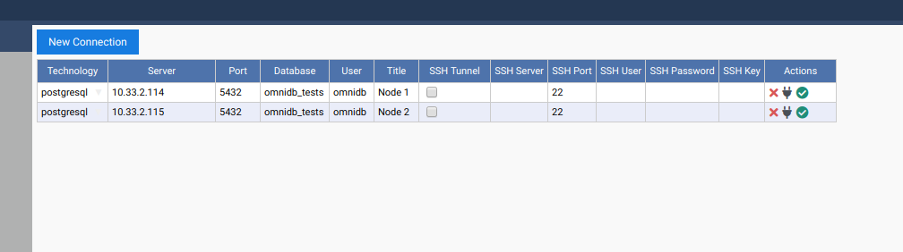

Then select both connections. Note how OmniDB understands it is connected to PostgreSQL 10 and enables a new node in the current connection tree view: it is called Logical Replication. Inside of it, we can see Publications and Subscriptions.

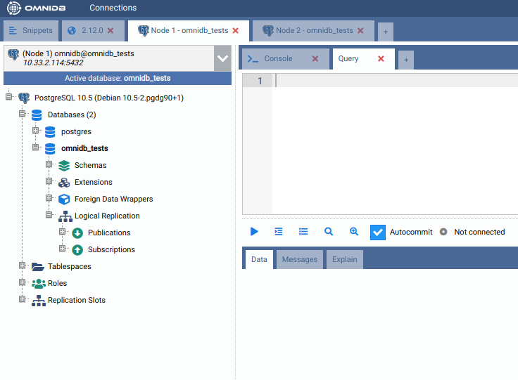

#### Creating a test table on both nodes

On both nodes, create a table like this:

```sql
CREATE TABLE customers (
 login text PRIMARY KEY,
 full_name text NOT NULL,
 registration_date timestamptz NOT NULL DEFAULT now()
)
```


#### Create a publication on the first machine
Inside the connection node, expand the Logical Replication node, then right click in the Publications node, and choose the action Create Publication. OmniDB will open a SQL template tab with the **CREATE PUBLICATION** command ready for you to make some adjustments and run:

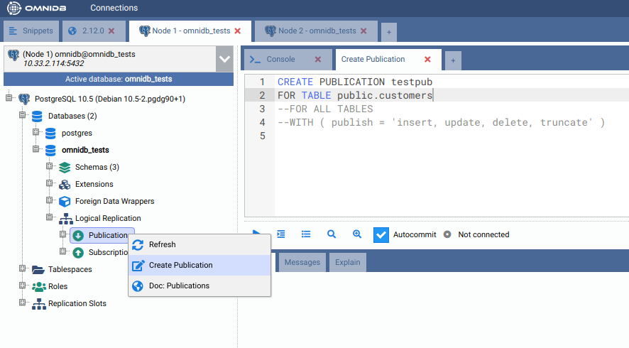

After adjusting and executing the command, you can right click the Publications node again and click on the Refresh action. You will see that will be created a new node with the same name you gave to the publication. Expanding this node, you will see the details and the tables for the publication:

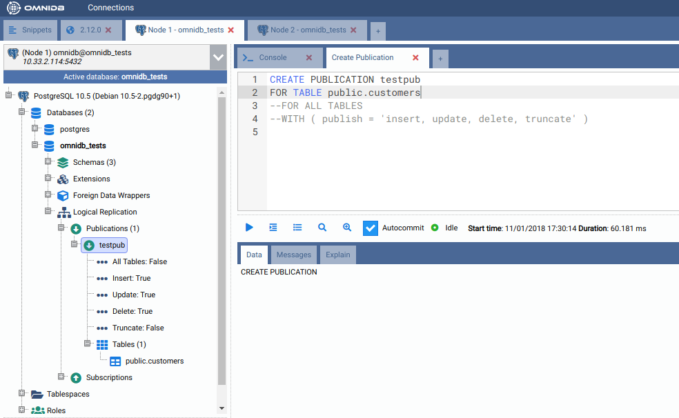

### Create a subscription on the second machine
Inside the connection node, expand the Logical Replication node, then right click in the Subscriptions node, and choose the action **Create Subscription**. OmniDB will open a SQL template tab with the CREATE SUBSCRIPTION command ready for you to make some adjustments and run:

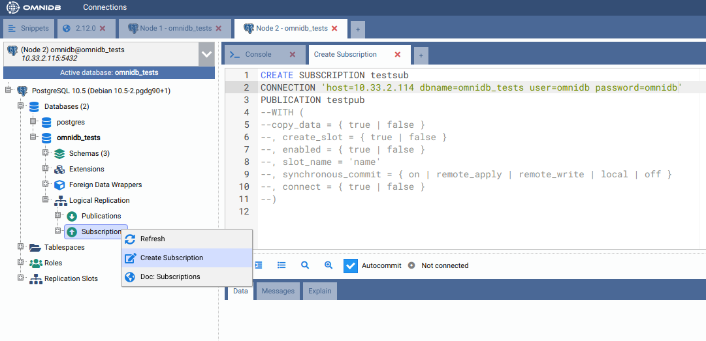

After adjusting and executing the command, you can right click the **Subscriptions** node again and click on the **Refresh** action. You will see that will be created a new node with the same name you gave to the subscription. Expanding this node, you will see the details, the referenced publications and the tables for the subscription:

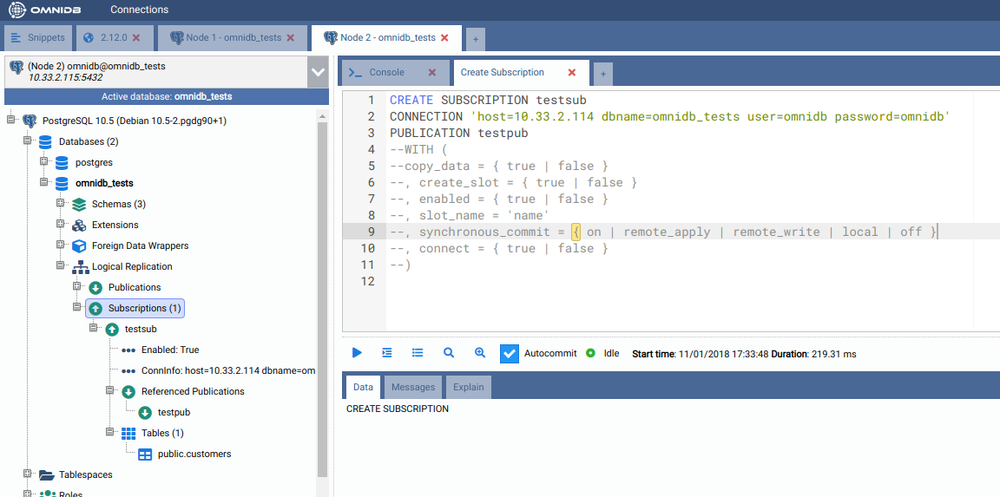

Also, the **CREATE SUBSCRIPTION** command created a **logical replication slot** called **testsub** (the same name as the subscription) in the first machine:

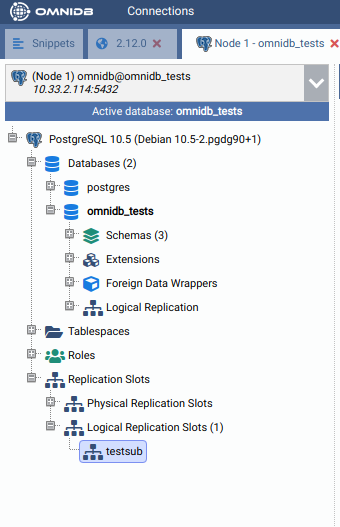

### Testing the logical replication

To test the replication is working, let's create some data on the node 1. Right click on the table **public.customers**, then point to **Data Actions**, then click on the action Edit Data. In this grid, you are able to add, edit and remove data from the table. Add 2 sample rows, like this:

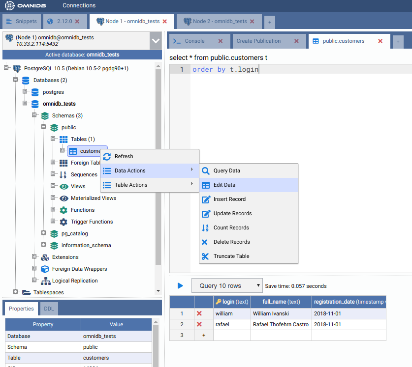

Then, on the other node, check if the table **public.customers** was automatically populated. Right click on the table **public.customers**, then point to **Data Actions**, then click on the action Query Data:

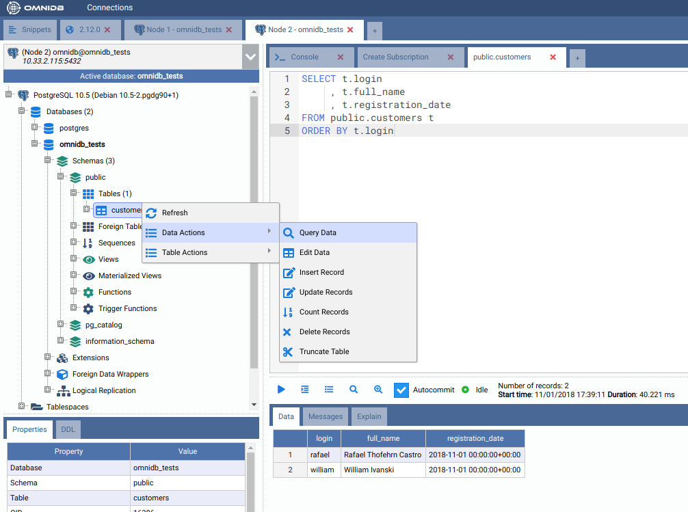

As we can see, both rows created in the first machine were replicated into the second machine. This tell us that the logical replication is working.

Now you can perform other actions, such as adding/removing tables to the publication and creating a new publication that publishes all tables.

## Pglogical

[pglogical](https://www.2ndquadrant.com/en/resources/pglogical/) is a PostgreSQL extension that provides an advanced logical replication system that serves as a highly efficient method of replicating data as an alternative to physical replication.

In this case[centos7-postgres-11-pglogical-lab](https://github.com/robert0714/PostgreSQL-10-Administration-Cookbook/tree/master/Chapter12/labs/centos7-postgres-11-pglogical-lab), we will use a 2-node cluster to demonstrate pglogical with PostgreSQL 11. Note that on each PostgreSQL instance, you need to configure:(postgres.conf)

```conf
wal_level = 'logical'
track_commit_timestamp = on
max_worker_processes = 10   # one per database needed on provider node
                            # one per node needed on subscriber node
max_replication_slots = 10  # one per node needed on provider node
max_wal_senders = 10        # one per node needed on provider node
shared_preload_libraries = 'pglogical'
```

Also make sure to adjust file pg_hba.conf to grant access to replication between the 2 nodes.

### OmniDB repository provides a 2-node Vagrant test environment. If you want to use it, please do the following:


```bash
git clone --depth 1  https://github.com/robert0714/PostgreSQL-10-Administration-Cookbook.git
cd PostgreSQL-10-Administration-Cookbook/Chapter12/labs/centos7-postgres-11-pglogical-lab
vagrant up
```

It will take a while, but once finished, 2 virtual machines with IP addresses **100.100.110.101** and ***100.100.110.102*** will be up and each of them will have PostgreSQL 10 listening to port ***5432***, with all settings needed to configure pglogical replication. A new database called ***omnidb_tests*** is also created on both machines. To connect, user is ***omnidb*** and password is ***omnidb***.

### Install OmniDB pglogical plugin
OmniDB core does not support pglogical by default. You will need to download and install pglogical plugin. If you are using OmniDB server, these are the steps:

```
wget  https://omnidb.org/dist/plugins/omnidb-pglogical_1.0.0.zip 
```

By clicking on the "plugins" icon in the top right corner, you will see the  button "Select plugin package tobe installed.."

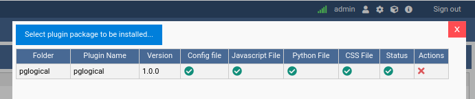

If everything worked correctly, by clicking on the "plugins" icon in the top right corner, you will see the plugin installed and enabled:

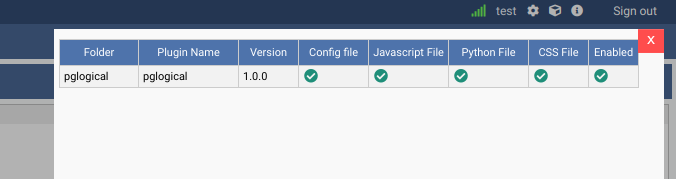


###  Connecting to both nodes

Let's use OmniDB to connect to both PostgreSQL nodes. First of all, fill out connection info in the connection grid:

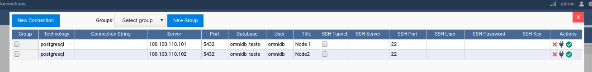

Then select both connections.

###   Create pglogical extension in both nodes

pglogical requires an extension to be installed in both nodes. Inside OmniDB, you can create the extension by right clicking on the Extensions node, and choosing the action ***Create Extension***. OmniDB will open a SQL template tab with the ***CREATE EXTENSION*** command ready for you to make some adjustments and run:

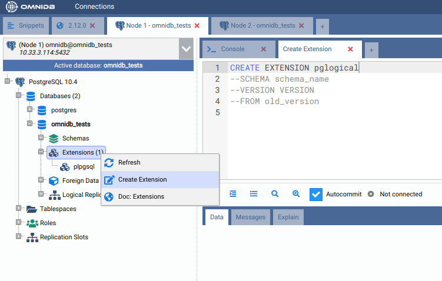

After you have created the extension, you need to refresh the root node of the treeview, by right-clicking on it and choosing **Refresh**. Then you will see that OmniDB already acknowledges the existence of pglogical in this database. However, pglogical is not active yet.

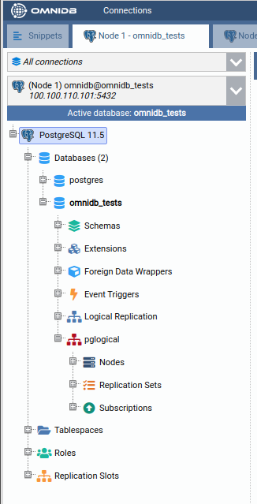

### Create pglogical nodes
To activate pglogical in this database, we need to create a pglogical node on each machine. Inside the ***pglogical*** node of the treeview, right click **Nodes**, then choose ***Create Node***. In the SQL template that will open, adjust the node name and the DSN and run the command.

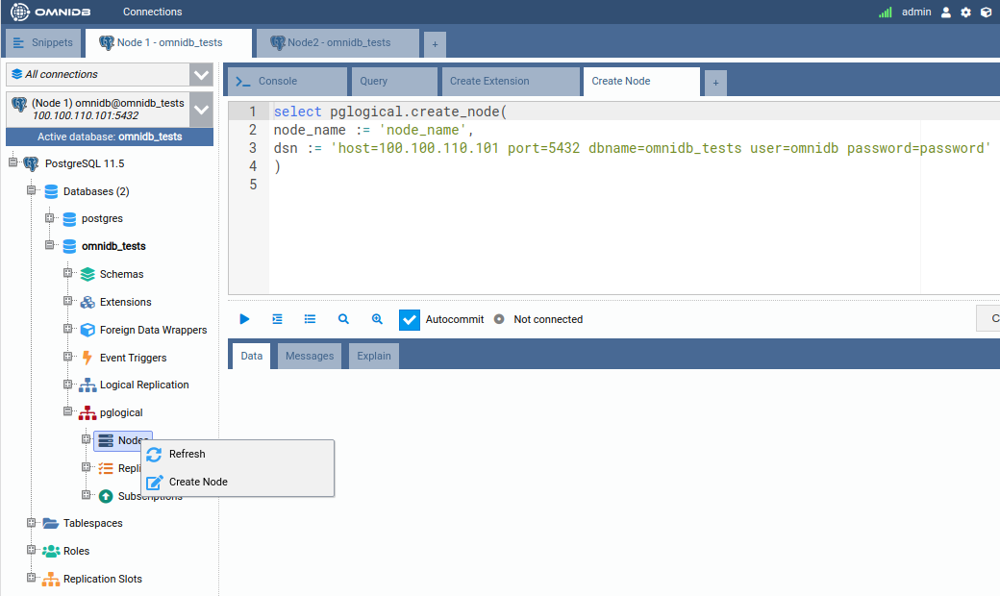

Then right click ***Nodes*** again, but this time choose **Refresh**. You will see the node you just created. Note how OmniDB understands that this node is local. Expand the local node to see its interface inside. You can manage the interfaces of the nodes using OmniDB too.

Go ahead and expand the ***Replication Sets*** node. You can see pglogical default replication sets are already created: **ddl_sql**, **default** and ***default_insert_only***. You can also manage replication sets using OmniDB.

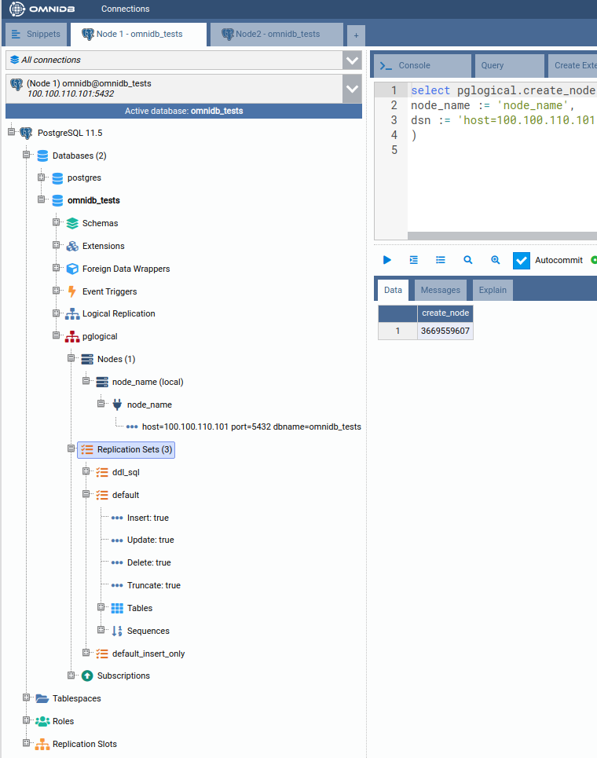

Now create a node on the other machine too. Choose a different name for the node.

### Create a table on the first machine
In the first machine, under the Schemas node, expand the ***public*** node, then right-click the ***Tables*** node and choose ***Create Table***. In the form tab that will open, give the new table a name and some columns. Also add a primary key in the **Constraints** tab. When done, click in the ***Save Changes*** button.

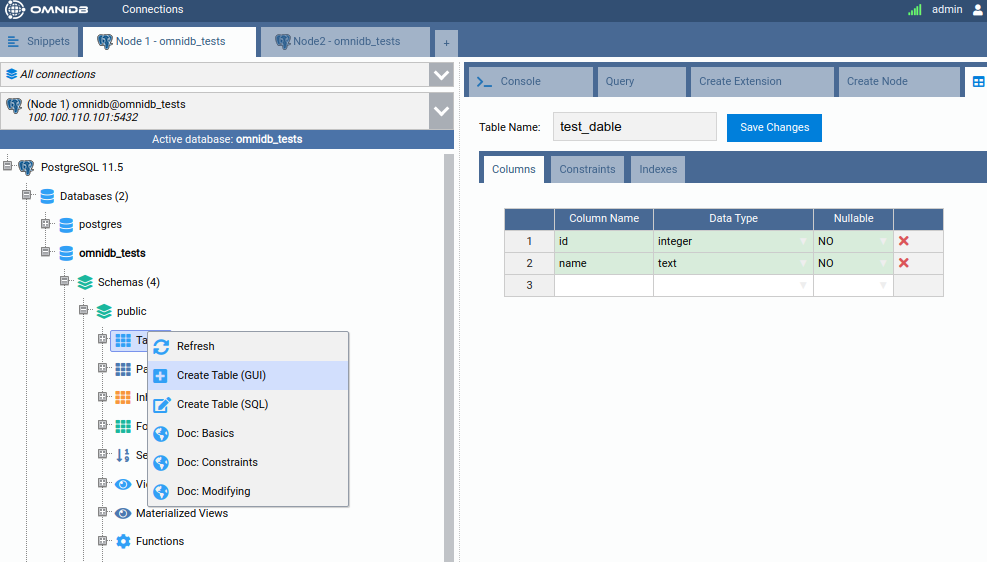

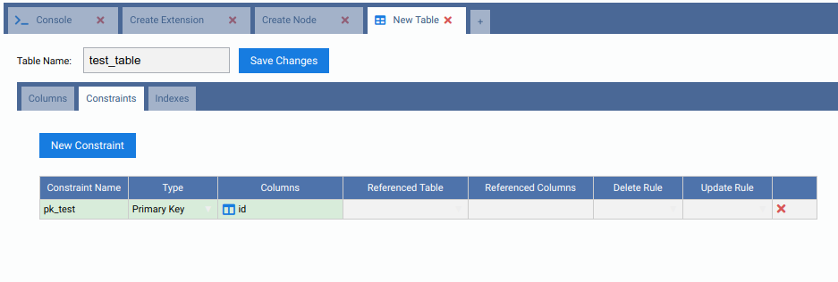

### Add the new table to a replication set on the first machine
In the first machine, under the ***default_insert_only*** replication set, right click the **Tables** node and choose **Add Table**. In the SQL template tab that will open, change the table name in the ***relation*** argument and then execute the command.

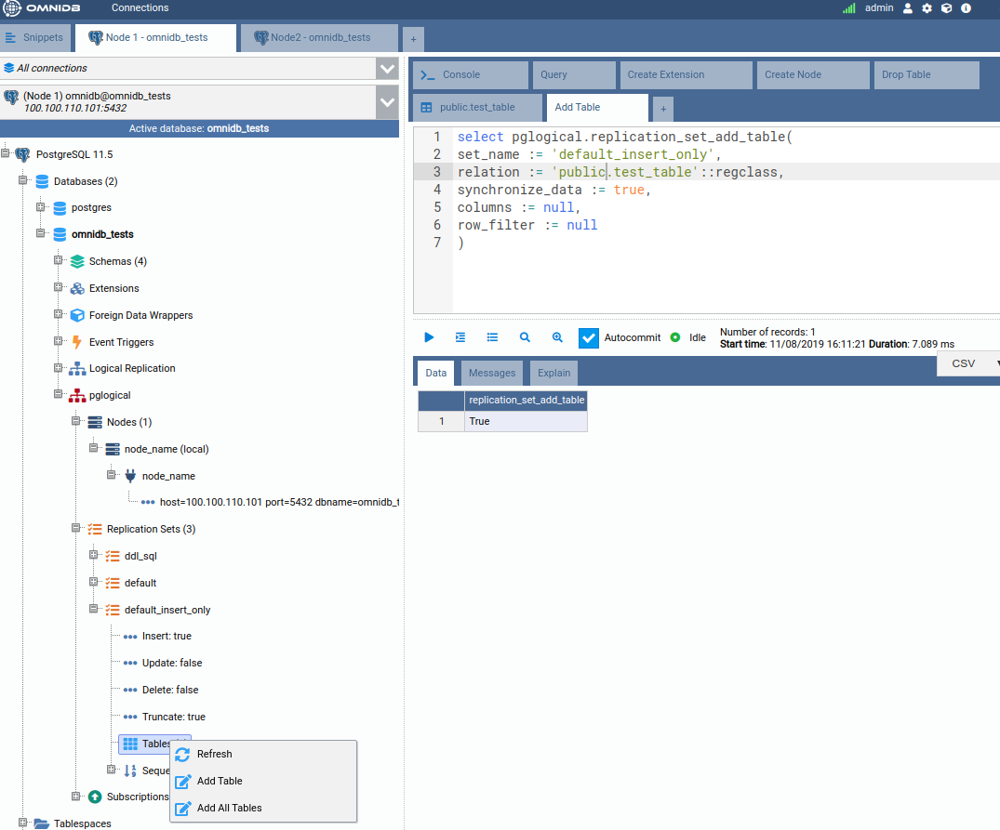
Refresh the **Tables** node to check the table was added to the replication set.

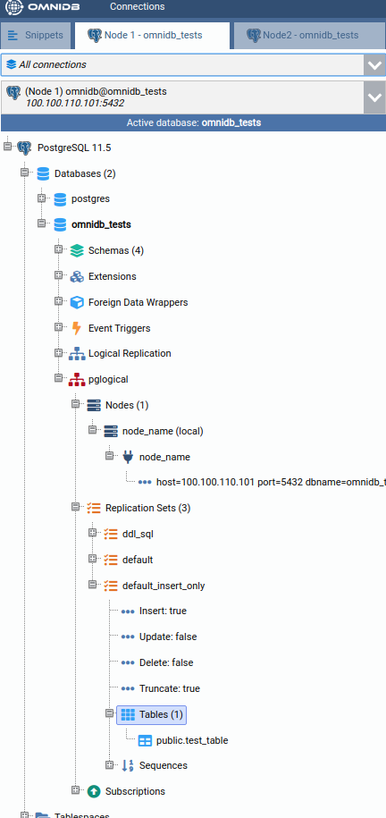

### Add a subscription on the second machine
In the second machine, right-click the ***Subscriptions*** node and choose Create Subscription. In the SQL template tab that will open, change DSN of the first machine and then execute the command.

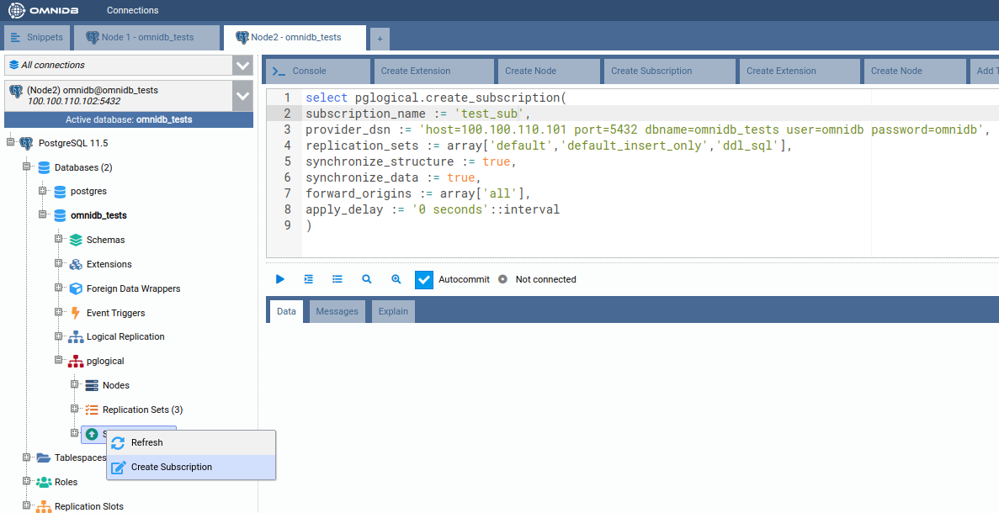

Refresh and expand both Nodes and Subscriptions nodes of the treeview. Note how now the second machine knows about the first machine. Also check the information OmniDB shows about the subscription we just created.

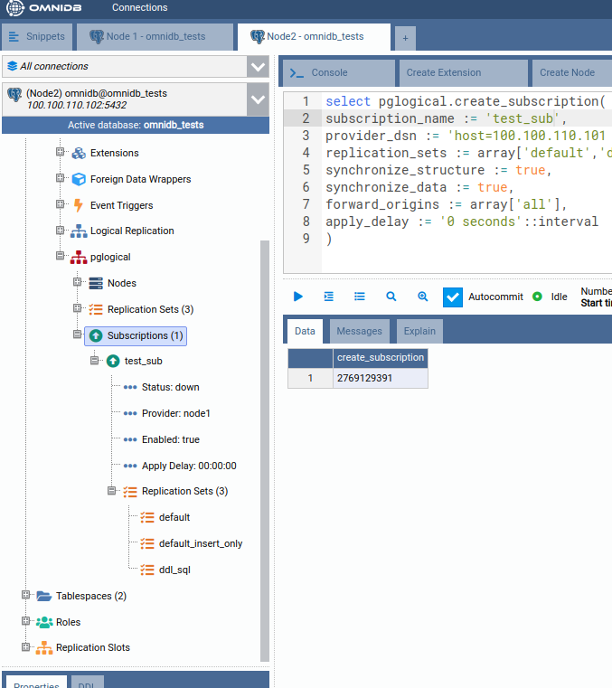

Also verify that the table public.test_table was created automatically in the second machine:

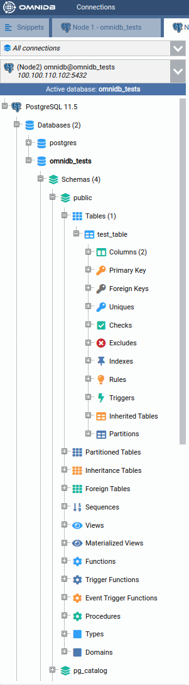

### Add some data in the table on the first machine
In the first machine, under the **Schemas** node, expand the **public** node and the **Tables** node. Right-click in our table, **test_table**, move the mouse pointer to **Data Actions** and then click on **Edit Data**. Insert some data to the table. When finished, click on the Save Changes button.

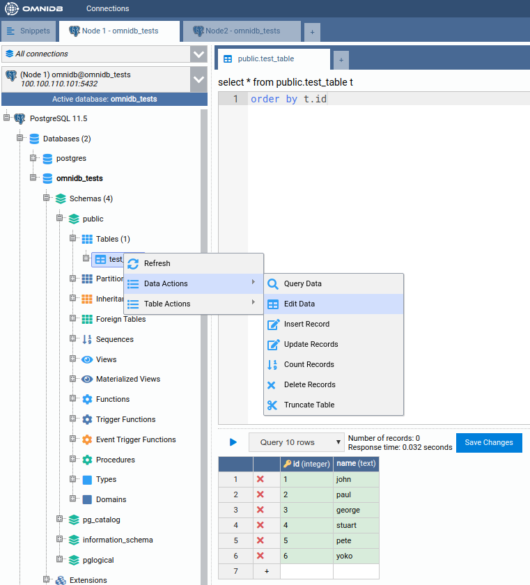

Now let us check the data was replicated. Go to the second machine and right-click the table, move the mouse pointer to Data Actions and then click on **Query Data**.

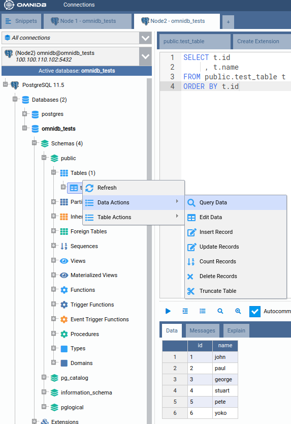

### Check if delete is being replicated
In the Edit Data tab in the first machine, remove Pete and Stuart. Click on the button **Save Changes** when done.

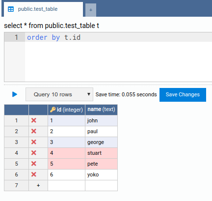

Check if these 2 rows were deleted in the second machine.

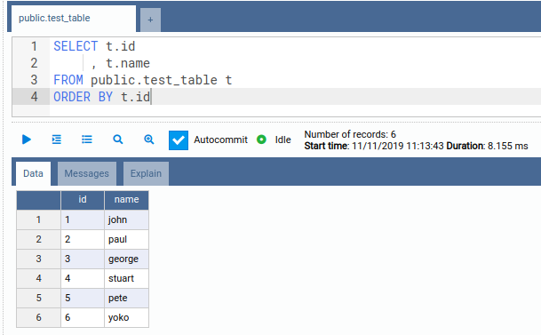

They were not removed in the second machine because the table ***public.test_table*** is in the replication set **default_insert_only**, that does not replicate updates and deletes.

## Bidirectional replication(Postgres-BDR)

Postgres-BDR builds upon the basic technology of logical replication, enhancing it in various ways. We refer heavily to the previous recipe, Logical replication.

Postgres-BDR 1 requires a modified version of PostgreSQL 9.4. Postgres-BDR 2 is available only as an interim measure as an extension for PostgreSQL 9.6. Postgres-BDR 3 is available as an extension for PostgreSQL 10 and 11. For the latest info, please consult https://www.2ndquadrant.com/en/resources/bdr/ .

Future versions of PostgreSQL may contain multi-master replication, though this will not be until at least PostgreSQL 13 as we go to press.

The BDR experts at 2ndQuadrant will help you evaluate the best deployment option based on your business needs, among the following options:

*  **Postgres Cloud Manager (PCM)**. PCM offers a quick and easy deployment of highly available BDR clusters using Trusted Postgres Architecture (TPA) from 2ndQuadrant. PCM is available for deployment on the Cloud – both public and private.


*  **Docker Images**. This option provides a flexible and quick deployment model for Postgres-BDR clusters. Docker images manage to reduce deployment times significantly, allowing you to create containers without external runtime requirements. It gives you the possibility of creating a personalized architecture with minimal configuration.

*  **Binary Repository**. Postgres-BDR is available for deployment via [2ndQuadrant’s yum & apt repositories](http://bdr-project.org/docs/stable/installation-packages.html) – designed and maintained for production use. The binaries, in the form of RPMs and DEBs respectively, can be installed using the native package managers of the operating system of your choice. This provides a stable and reliable access to the software, on-premise and in the Cloud.


 2ndQuadrant’s PostgreSQL Solution for Single Master with High Availability addresses exactly that requirement, and is based on years of experience fulfilling enterprise needs. The architecture relies on best practices and provides high levels of reliability for production use.
 
 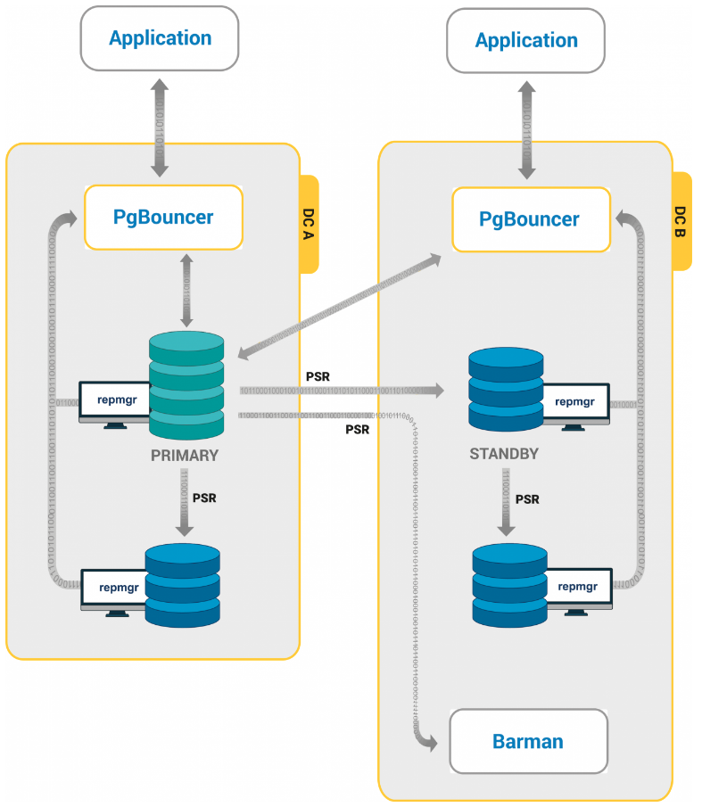

 Reference: 
 
 *  https://www.2ndquadrant.com/en/resources/highly-available-postgresql-clusters
 *  https://omnidb.org/en/documentation-en/17-postgres-bdr

